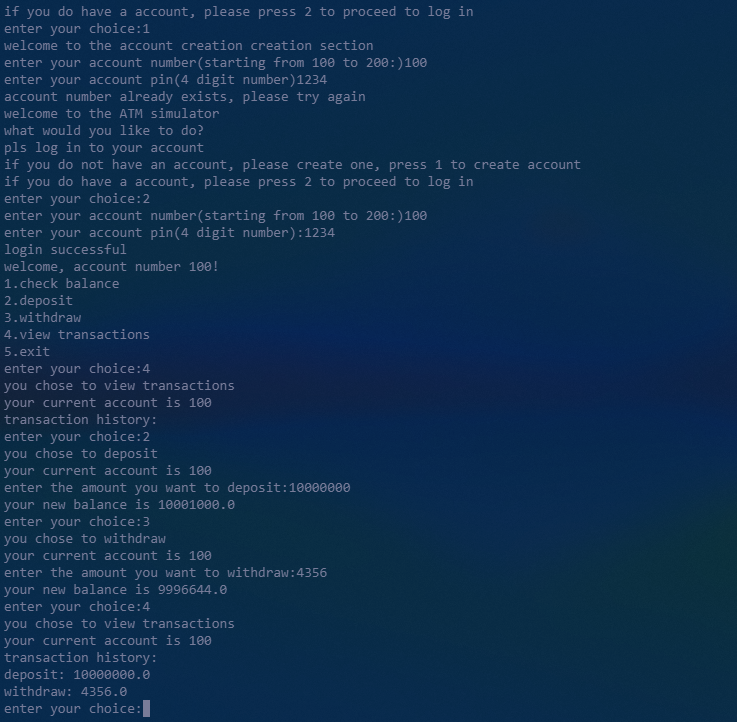
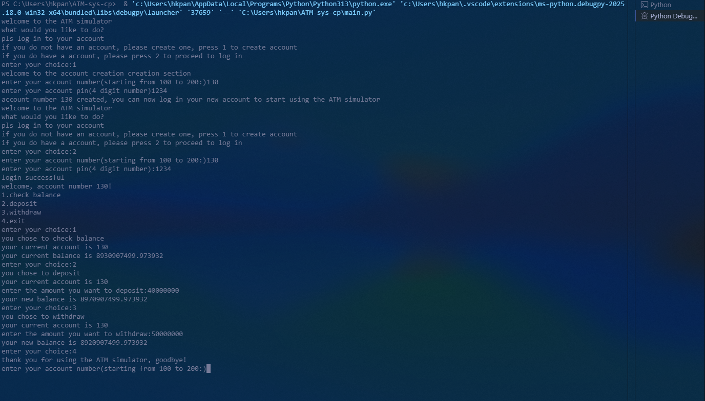

# 🏦 ATM Simulation System (Python Mini Project)

A simple **menu-driven ATM simulator** built using Python.  
This project demonstrates **real-world banking logic** using dictionaries and modular programming.

---

## 🚀 Features

- 🔐 Account Login (Account Number + PIN)
- 💰 Check Balance
- ➕ Deposit Money
- ➖ Withdraw Money
- 📜 Transaction Tracking (basic)
- 🔁 Continuous Menu System (while loop)

---

## 🧠 Concepts Used

- Python Functions  
- Dictionaries (Data Storage)  
- Modular Programming  
- Conditional Logic  
- Loops (`while True`)  

---

## 📁 Project Structure
```
atm_project/
│
├── main.py # Main menu + login system
├── database.py # Stores account data
```
---
### WORKING





---

## ⚙️ How It Works

### 🔹 Account System

Each account is stored like this:

```python
accounts = {
    100: {
        "pin": "1234",
        "balance": 1000,
        "transactions": []
    }
}
```

## HOW TO RUN

```
python main.py
```
